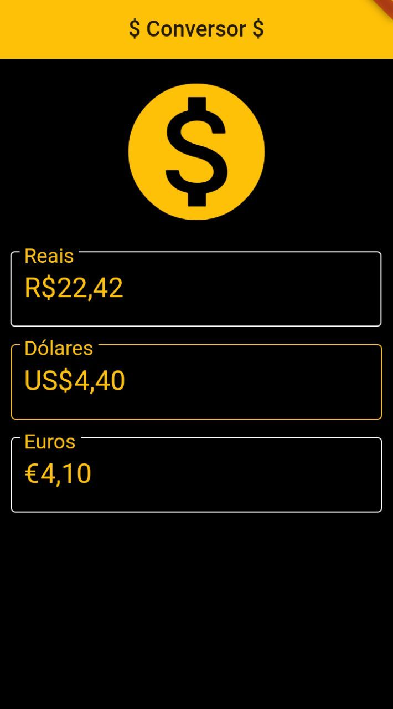

# currency_converter

<h2>🔎 Tecnologias Utilizadas<h2>
<ul>
  <a href="https://dart.dev/"><li>Linguagem Dart</li></a>
  <a href="https://flutter.dev/"><li>Flutter</li></a>
  <a href="https://hgbrasil.com/status/finance"><li>API HG Finance</li></a>
</ul>

<h2>💻 Sobre o Projeto<h2>
 
<h3>Este projeto se caracteriza como um conversor de moedas, possibilitando a visualização 
  do valor equilivalente entre os valores do Euro, Dólar e Real.
 
<h2>🚀 Como Contribuir<h2>
  
  <h4>1. Faça um fork desse repositório;
  <h4>2. Cria uma branch com a sua feature: <pre><code>git checkout -b minha-feature</code></pre>;
  <h4>3. Faça commit das suas alterações: git commit -m 'feat: Minha nova feature';
  <h4>4. Faça push para a sua branch: git push origin minha-feature;
  <h4>Depois que o merge da sua pull request for feito, você pode deletar a sua branch.
